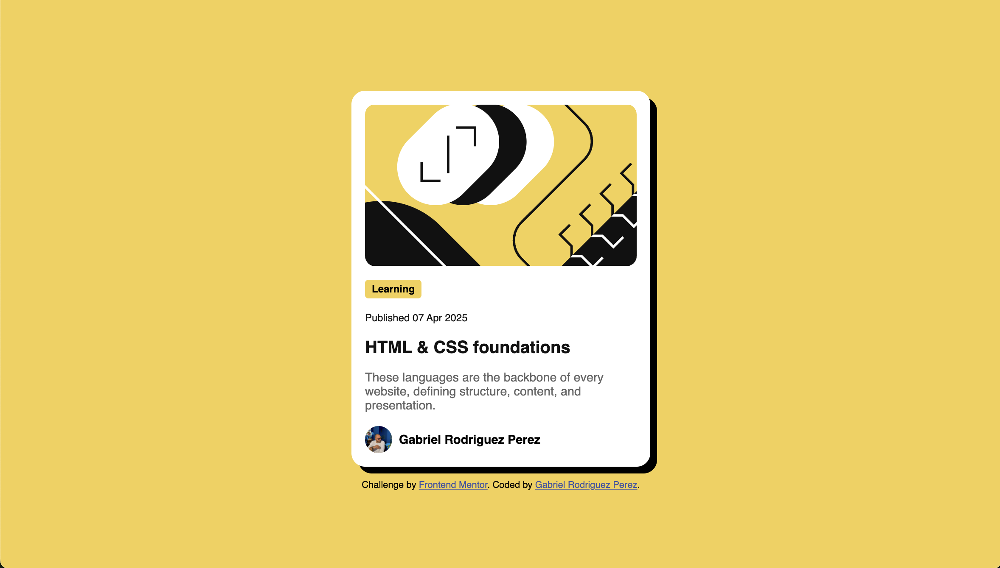
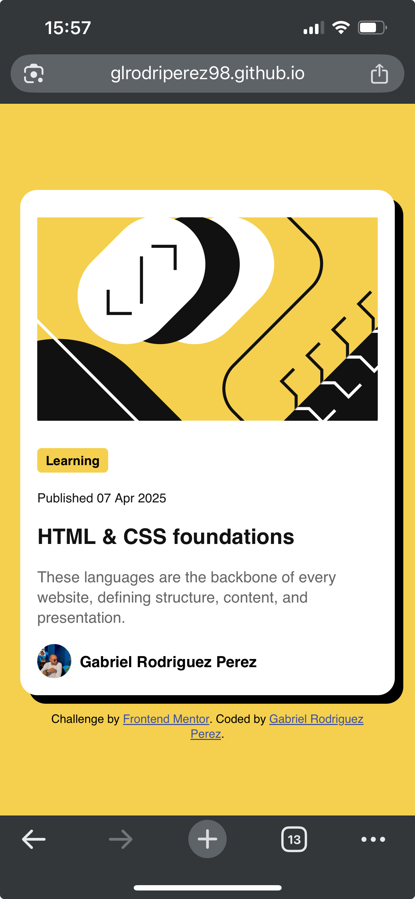

# Frontend Mentor - Blog preview card solution

This is a solution to the [Blog preview card challenge on Frontend Mentor](https://www.frontendmentor.io/challenges/blog-preview-card-ckPaj01IcS). Frontend Mentor challenges help you improve your coding skills by building realistic projects.

## Table of contents

- [Overview](#overview)
  - [The challenge](#the-challenge)
  - [Screenshot](#screenshot)
  - [Links](#links)
- [My process](#my-process)
  - [Built with](#built-with)
  - [What I learned](#what-i-learned)
  - [Continued development](#continued-development)
  - [Useful resources](#useful-resources)
- [Author](#author)
- [Acknowledgments](#acknowledgments)

## Overview

### The challenge

Users should be able to:

- See hover and focus states for all interactive elements on the page

### Screenshot




### Links

- Solution URL: [Blog Preview Card Challenge Solution](https://github.com/glrodriperez98/blog-preview-card)
- Live Site URL: [Blog Preview Card Challenge Live](https://glrodriperez98.github.io/blog-preview-card/)

## My process

### Built with

- Semantic HTML5
- CSS custom properties
- Flexbox
- Mobile-first workflow
- Google Fonts (Figtree)

### What I learned

This project helped reinforce key foundational concepts such as flexbox layout and hover/focus styling. I also practiced organizing content semantically and paid special attention to visual alignment and spacing.

#### A couple of snippets I’m proud of:

```
css
.card {
  background-color: white;
  border-radius: 1rem;
  box-shadow: 8px 8px 0px #000;
  display: flex;
  flex-direction: column;
  gap: 1rem;
}
```
```
css
.title a:hover {
  color: hsl(47, 88%, 63%);
}
```
These snippets show how I used Flexbox and subtle hover styling to enhance both structure and interactivity. It took me some time to work out the specific shape for the box-shadow and that is what I am most proud of for this project.

### Continued development
I'd like to continue improving my skills in responsive design and accessibility. For future versions of this project, I might explore how to make the card responsive across multiple screen sizes or include ARIA labels for better screen reader support.

### Useful resources
[***CSS Tricks - Flexbox Guide***](https://css-tricks.com/snippets/css/a-guide-to-flexbox/)

## Author
Gabriel L. Rodriguez Perez

Frontend Mentor - @glrodriperez98

Github - glrodriperez98

## Acknowledgments
Thanks to Frontend Mentor for providing this project and layout. The challenge structure really helped me focus on the design-to-code process in a clean, achievable way.
